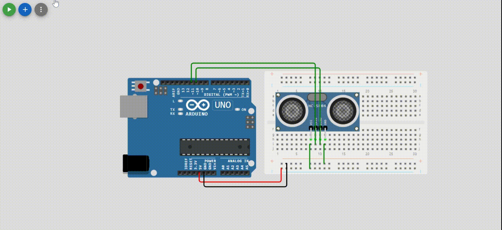
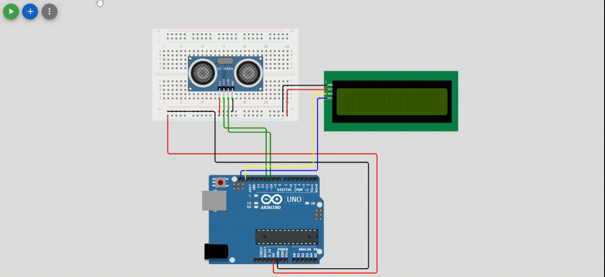
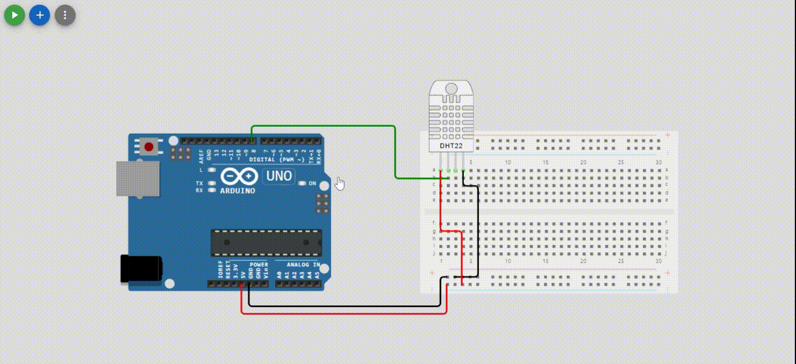
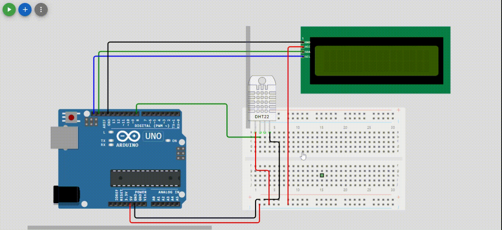

# tugas3-sistem-mikrokontroller
Repo ini digunakan untuk mengerjakan tugas 3 dari matakuliah sistem mikrokontroller.

## Sensor Jarak (HC-SR04) dengan serial monitor

## Sensor Jarak (HC-SR04) dengan LCD

## Sensor Suhu dengan DHT22 dan serial monitor

## Sensor Suhu dengan DHT22 dan LCD

### Author
- Aziz Arif Rizaldi
- Universitas Teknologi Bandung - 2024
